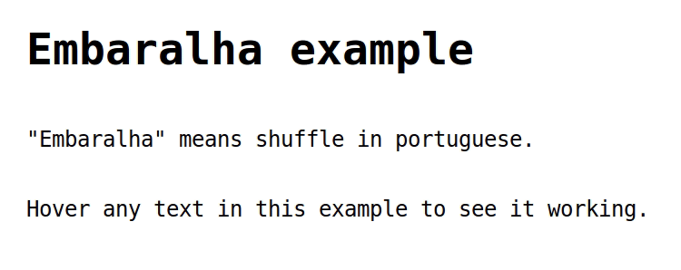

embaralha
=========


Shuffles characters in given html element, then restores it's original text. *Embaralha* means "to shuffle" in portuguese.



## Instalation

`npm i embaralha` or just grab the [index.js](index.js) file.

## Usage

If you want to shuffle the text in the `mouseover` event, you could do it like this:

``` javascript
import { embaralha } from 'embaralha';
const elem = document.querySelector('.your-embaralha-class');
elem.addEventListener('mouseover', async () => embaralha(elem, 1000));
```

## License

MIT License found in [LICENSE](LICENSE) file.
